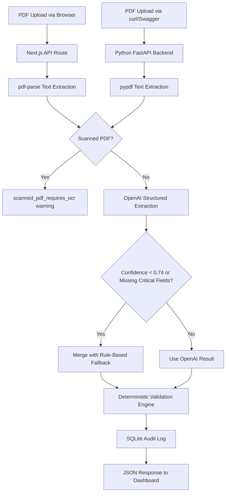

# Document AI Processing Pipeline

**by MaverickIQ**

[](https://github.com/faiazyen/document-ai-processing-pipeline/actions/workflows/ci.yml)

A production-style B2B invoice AI processing system. Uploads PDF invoices, extracts text, runs OpenAI structured extraction, fills gaps with deterministic fallback rules, validates all fields, persists results, and exposes a typed REST API — all backed by a Python FastAPI service and a Next.js dashboard.

Built for portfolio conversations around **AI Platform Engineer** and **GenAI Developer** roles — particularly [Rossum](https://rossum.ai)-style document intelligence systems.

---

## Architecture



```
Frontend (Next.js + TypeScript)          Backend (Python FastAPI)
┌─────────────────────────┐              ┌──────────────────────────────┐
│ Upload Panel            │              │ POST /process-invoice        │
│ Pipeline Steps          │  HTTP/REST   │ GET  /invoices               │
│ Extraction Result       │ ──────────▶  │ GET  /invoices/{id}          │
│ Validation Panel        │              │ GET  /health                 │
│ JSON Viewer             │              │ GET  /metrics                │
└─────────────────────────┘              │ Swagger UI at /docs          │
                                         └──────────────────────────────┘
                                                    │
                                         ┌──────────┴──────────┐
                                         │ SQLite (dev)         │
                                         │ PostgreSQL (prod)    │
                                         └──────────────────────┘
```

---

## Stack

### Frontend
- Next.js 16 App Router — React 19, TypeScript, Tailwind CSS v4
- `pdf-parse` — server-side PDF text extraction
- `openai` SDK — structured extraction with Zod response parsing
- Vitest — unit tests

### Backend (Python)
- FastAPI — REST API + Swagger/OpenAPI auto-docs
- `pypdf` — PDF text extraction
- `openai` Python SDK — LLM structured extraction
- SQLAlchemy + SQLite — persistence and audit log
- Pydantic v2 — request/response schemas
- pytest + anyio — async test suite

### Infrastructure
- Docker + Docker Compose — containerized local dev
- GitHub Actions — CI for both frontend and backend
- Vercel — frontend production deployment
- Kubernetes manifests — production deployment reference

---

## Live Demo

Deploy to Vercel: [](https://vercel.com/new/clone?repository-url=https://github.com/faiazyen/document-ai-processing-pipeline)

---

## Pipeline Steps

```
PDF upload
  → text extraction (pdf-parse / pypdf)
  → scanned PDF detection
  → OpenAI structured extraction (gpt-4.1-mini)
  → rule-based fallback when confidence < 0.74 or critical fields missing
  → deterministic validation (10+ rules)
  → SQLite persistence / audit log
  → confidence score, warnings, extraction source, JSON output
```

---

## Python FastAPI Backend + Swagger API

The Python backend (`services/ai-api/`) exposes the full invoice pipeline as a standalone REST service, making the project independently usable as a microservice.

```bash
cd services/ai-api
pip install -r requirements.txt
uvicorn app.main:app --reload --port 8000
```

**Swagger UI:** http://localhost:8000/docs

| Endpoint | Method | Description |
|----------|--------|-------------|
| `/process-invoice` | POST | Upload PDF → extract → validate → persist |
| `/invoices` | GET | List all processed invoice summaries |
| `/invoices/{id}` | GET | Get full extraction result by ID |
| `/health` | GET | Service status + OpenAI config check |
| `/metrics` | GET | In-memory processing counters |

The backend demonstrates:
- **Python** — all backend code in Python 3.9+
- **FastAPI** — async REST API with auto-generated OpenAPI 3.1 spec
- **REST APIs** — typed endpoints with proper HTTP status codes
- **Swagger/OpenAPI** — interactive documentation at `/docs`
- **Document processing** — PDF ingestion, text extraction, scanned detection
- **GenAI extraction** — OpenAI SDK with structured JSON output
- **Validation** — 10+ deterministic rules, warning codes with severity levels
- **Persistence** — SQLAlchemy ORM, full audit log, ID-addressable records
- **Monitoring** — `/health` and `/metrics` endpoints for ops visibility

See [docs/API_OPENAPI.md](docs/API_OPENAPI.md) for the full API reference.

---

## Local Setup (Frontend)

```bash
npm install
cp .env.example .env.local
# Add OPENAI_API_KEY to .env.local
npm run dev
```

App runs at http://localhost:3000

---

## Local Setup (Python Backend)

```bash
cd services/ai-api
python -m venv .venv
source .venv/bin/activate
pip install -r requirements.txt
cp .env.example .env
# Add OPENAI_API_KEY to .env
uvicorn app.main:app --reload --port 8000
```

---

## Docker Compose (Both Services)

```bash
OPENAI_API_KEY=your-key docker compose up --build
```

- Frontend: http://localhost:3000
- Backend + Swagger: http://localhost:8000/docs

**Troubleshooting:**

| Issue | Fix |
|-------|-----|
| `OPENAI_API_KEY` missing | App still runs with fallback extraction — no crash |
| Port already in use | Change ports in `docker-compose.yml` |
| PDF parsing failure | Ensure the file is a valid, non-password-protected PDF |
| Vercel build fails | Vercel deploys frontend only. Run backend separately. |

---

## Commands

```bash
# Frontend
npm run dev          # local dev server
npm run lint         # ESLint
npm test             # Vitest unit tests
npm run build        # production build

# Python backend
cd services/ai-api
pytest tests/ -v     # 24 tests

# Docker
docker compose up --build
docker compose down
```

---

## Testing Summary

| Suite | Tests | Status |
|-------|-------|--------|
| TypeScript / Vitest | 5 | Passing |
| Python / pytest | 24 | Passing |
| **Total** | **29** | **All passing** |

Python tests cover: validation rules, fallback extraction, SQLite persistence, health and metrics endpoints.

---

## Experimental LangChain Module

`services/ai-api/app/experimental/langchain_extractor.py` provides an alternative extraction path using LangChain's `ChatOpenAI` and `JsonOutputParser`.

```bash
pip install langchain langchain-openai
```

**Why this exists:** GenAI Developer roles often mention LangChain. This module demonstrates working knowledge while documenting the honest tradeoff: direct OpenAI SDK calls are simpler, faster, and easier to debug for this focused extraction task. LangChain earns its complexity when you need multi-step chains, tool use, memory, or RAG.

---

## Documentation

| Document | Description |
|----------|-------------|
| [Architecture](docs/ARCHITECTURE.md) | System design and reliability strategy |
| [API Contract](docs/API_CONTRACT.md) | Next.js API route specification |
| [API OpenAPI](docs/API_OPENAPI.md) | Python FastAPI / Swagger reference |
| [Invoice Schema](docs/INVOICE_SCHEMA.md) | Field definitions and extraction logic |
| [Schema and Validation](docs/INVOICE_SCHEMA_AND_VALIDATION.md) | Validation rules explained |
| [Testing and Debugging Audit](docs/TESTING_AND_DEBUGGING_AUDIT.md) | Full QA report with test matrix |
| [Interview Walkthrough](docs/INTERVIEW_WALKTHROUGH.md) | End-to-end architecture explanation |
| [Execution Checklist](docs/EXECUTION_CHECKLIST.md) | Build and deploy steps |

---

## Kubernetes Reference

Deployment manifests in `k8s/` demonstrate production-style container orchestration.

```bash
kubectl apply -f k8s/backend-deployment.yaml
kubectl apply -f k8s/backend-service.yaml
```

See [k8s/README.md](k8s/README.md) for local minikube instructions.

---

## Invoice Output Schema

```json
{
  "document_type": "invoice",
  "supplier_name": "Acme Textiles GmbH",
  "supplier_country": "DE",
  "buyer_name": "Merch Maverick Ltd",
  "invoice_number": "INV-2024-042",
  "invoice_date": "2024-03-15",
  "due_date": "2024-04-15",
  "currency": "EUR",
  "subtotal": 1480.00,
  "vat_amount": 296.00,
  "total_amount": 1776.00,
  "line_items": [
    { "description": "Custom Polo Shirts", "quantity": 100, "unit_price": 12.00, "total": 1200.00 }
  ],
  "payment_terms": "Net 30",
  "confidence_score": 0.91,
  "validation_warnings": [],
  "extraction_source": "openai",
  "processing_ms": 1342.5
}
```

---

## Production Readiness Notes

This is intentionally scoped as a portfolio demo, but the architecture leaves clean seams for production hardening:

- **OCR** — scanned PDFs are detected and flagged; production routes to AWS Textract / Azure Document Intelligence / Google Document AI
- **Object storage** — uploaded PDFs would go to S3 or GCS with signed URL retrieval
- **Async queue** — large PDF batches need a job queue (Celery/SQS) to avoid request timeouts
- **PostgreSQL** — swap `DATABASE_URL` to replace SQLite with no schema changes
- **Auth layer** — API key or OAuth2 via FastAPI's security utilities
- **Rate limiting** — per-client throttle with `slowapi` or API gateway
- **Observability** — OpenTelemetry traces, Prometheus metrics, Grafana dashboards
- **Structured logs** — JSON logs with correlation IDs for Datadog/Splunk
- **Model tracking** — log model name and version per extraction for drift analysis
- **Human review queue** — invoices with high-severity warnings route to manual review

---

## GitHub Topics

`document-ai` `genai` `openai` `fastapi` `nextjs` `typescript` `python` `invoice-processing` `mlops` `ai-platform` `llm` `docker` `ci-cd` `rag`
