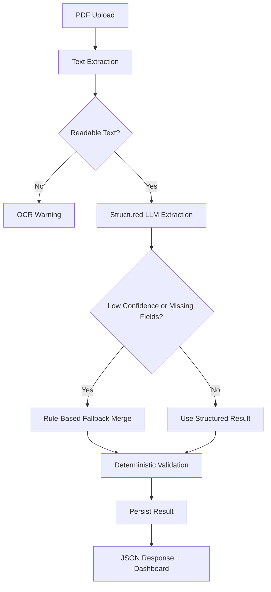

# Document AI Processing Pipeline

[](https://github.com/faiazyen/document-ai-processing-pipeline/actions/workflows/ci.yml)

A personal document-processing experiment for extracting structured invoice data from PDF files. The project combines a Next.js dashboard, a tenant-aware Python FastAPI service, deterministic validation, fallback extraction, async inference jobs, usage accounting, tests, Docker, and deployment-ready configuration.

The goal is simple: take an invoice PDF, extract useful text, ask an LLM for structured fields, verify the result with deterministic rules, and show the final JSON in a way that is easy to inspect.

---

## Architecture



The repository includes two ways to run the pipeline:

- **Next.js app**: interactive dashboard and API route for PDF uploads.
- **FastAPI service**: tenant-aware REST API with Swagger/OpenAPI, persistence, async jobs, health checks, p95 latency metrics, and estimated cost tracking.

---

## Stack

### Frontend

- Next.js 16 App Router
- React 19
- TypeScript
- Tailwind CSS v4
- `pdf-parse`
- OpenAI TypeScript SDK
- Vitest

### Backend

- Python 3.11
- FastAPI
- Pydantic v2
- SQLAlchemy
- SQLite for local persistence
- PostgreSQL-compatible database configuration
- `pypdf`
- OpenAI Python SDK
- pytest

### Infrastructure

- Docker
- Docker Compose
- GitHub Actions CI
- Vercel-ready frontend deployment
- Kubernetes reference manifests

---

## What It Does

- Uploads PDF invoices.
- Extracts readable PDF text.
- Detects image-only PDFs that need OCR.
- Produces structured invoice fields.
- Uses fallback rules when structured extraction is incomplete.
- Validates missing fields, currency, totals, tax arithmetic, line items, and confidence.
- Persists processed invoices through the FastAPI service.
- Supports tenant-scoped FastAPI access through hashed API keys.
- Creates async inference jobs with persisted job state.
- Tracks p95 processing latency and estimated OpenAI cost when pricing is configured.
- Exposes `/health`, `/metrics`, `/docs`, and `/openapi.json`.
- Renders confidence, warnings, and final JSON in the UI.

---

## Local Frontend Setup

```bash
npm install
cp .env.example .env.local
npm run dev
```

Frontend runs at:

```text
http://localhost:3000
```

Add `OPENAI_API_KEY` to `.env.local` only if you want live LLM extraction. Without it, the pipeline still runs with deterministic fallback extraction.

---

## Local FastAPI Setup

```bash
cd services/ai-api
python -m venv .venv
source .venv/bin/activate
pip install -r requirements.txt
cp .env.example .env
uvicorn app.main:app --reload --port 8000
```

Swagger UI:

```text
http://localhost:8000/docs
```

Core endpoints:

| Method | Path | Description |
| --- | --- | --- |
| POST | `/process-invoice` | Upload and process a PDF invoice |
| POST | `/inference/jobs` | Create an authenticated tenant-scoped async job |
| GET | `/inference/jobs` | List authenticated tenant jobs |
| GET | `/inference/jobs/{job_id}` | Read one authenticated tenant job |
| GET | `/tenants/me` | Read authenticated tenant configuration |
| GET | `/tenants/me/usage` | Read tenant usage and estimated cost |
| GET | `/invoices` | List authenticated tenant invoice summaries |
| GET | `/invoices/{id}` | Read one authenticated tenant invoice |
| GET | `/health` | Service status |
| GET | `/metrics` | In-memory processing, p95 latency, and cost counters |

Platform endpoints require `X-API-Key`. For local development, set `PLATFORM_DEV_API_KEY` in `services/ai-api/.env`; startup seeds the default tenant and stores only a hashed API key.

---

## Docker Compose

```bash
OPENAI_API_KEY=your-key docker compose up --build
```

Services:

- Frontend: http://localhost:3000
- FastAPI + Swagger: http://localhost:8000/docs

Stop everything:

```bash
docker compose down
```

---

## Commands

```bash
# Frontend
npm run dev
npm run lint
npm test
npm run build

# Backend
cd services/ai-api
python -m pytest tests/ -v

# Docker
docker compose build
docker compose up -d
docker compose down
```

---

## Test Coverage

| Suite | Tests |
| --- | ---: |
| TypeScript / Vitest | 11 |
| Python / pytest | 32 |
| Total | 43 |

Tests cover fallback extraction, validation rules, persistence, tenant isolation, API-key auth, usage aggregation, health/metrics endpoints, OpenAPI exposure, and API error response shape.

---

## Example Output

```json
{
  "document_type": "invoice",
  "supplier_name": "Northstar Print Studio",
  "buyer_name": "Atlas Retail Group",
  "invoice_number": "INV-2026-042",
  "invoice_date": "2026-06-08",
  "due_date": "2026-06-30",
  "currency": "USD",
  "subtotal": 2940,
  "vat_amount": 588,
  "total_amount": 3528,
  "line_items": [
    {
      "description": "Custom Embroidered Hoodies",
      "quantity": 120,
      "unit_price": 24.5,
      "total": 2940
    }
  ],
  "payment_terms": "Net 30",
  "confidence_score": 0.91,
  "validation_warnings": [],
  "extraction_source": "openai"
}
```

---

## Design Notes

This project intentionally keeps AI output behind a validation boundary. The model can help extract structure, but deterministic code decides whether the result is complete, internally consistent, and safe to present.

Known limitations:

- OCR is not implemented yet.
- The fallback extractor is intentionally conservative.
- Metrics are in-memory and reset on restart.
- Async jobs currently use FastAPI background execution; a durable external queue is the next production step.
- Autoscaling manifests are reference configuration, not proof of measured production scale.
- The project defines SLO targets and metrics, but does not claim measured 99.95% production availability.

Future improvements:

- OCR for scanned documents.
- Field-level confidence.
- Labeled fixture set for extraction-quality regression tests.
- Object storage for uploaded PDFs.
- Durable queue and independent worker deployment.
- Prometheus/OpenTelemetry instrumentation.
- Region-aware routing beyond job metadata.
